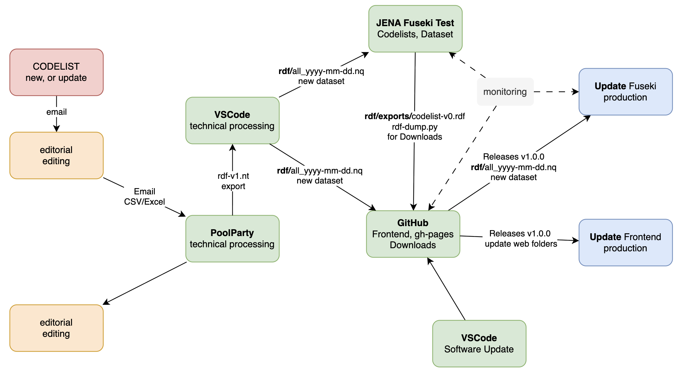

# registry-test

This repository is a static front-end prototype for the Austrian INSPIRE Registry, composed of three HTML entry points, one custom stylesheet plus Bootstrap, and a mix of custom and third-party JavaScript modules.

`index.html` is the primary application shell. It loads `css/bootstrap.css` and `css/style.css`, then initializes search, codelist tables, provider tabs, and concept/detail views through `js/pv.js` and configuration constants in `js/pv_config.js`. Core behavior includes SPARQL-backed data retrieval from a Fuseki endpoint, language-aware rendering (`de`/`en`), URI normalization, safe link/HTML escaping, and dynamic UI generation with jQuery. It also integrates `js/fuse.min.js` for typeahead search and `js/sortable-table.js` for client-side table sorting.

`tbl.html` is a focused export/detail view for one codelist URI. It builds a SPARQL query, fetches JSON results, and renders an HTML table with defensive escaping and controlled URI validation.

`diagram.html` is a visualization page. It wires `js/d3_data.js` (SPARQL-to-hierarchy transformation) to `js/d3_tree.js` (interactive D3 tree rendering with expand/collapse behavior). It also loads `js/echarts.js` for charting compatibility, while current tree rendering is D3-driven.

Custom styling in `css/style.css` defines registry-specific UI rules (search dropdowns, relation tables, concept card grids, pagination tweaks, language/datatype badges, icon filters, and responsive spacing). `css/bootstrap.css` provides base layout/components.

Bundled vendor scripts include `js/jquery.min.js`, `js/bootstrap.bundle.min.js`, `js/bootstrap.min.js`, `js/d3.v7.min.js`, `js/fuse.min.js`, and `js/echarts.js`; custom logic lives in `js/pv.js`, `js/pv_config.js`, `js/d3_data.js`, and `js/d3_tree.js`.

### Summary: Codelist-Registry Publication Workflow

The publication process of the Codelist-Registry is a structured workflow involving four key stakeholders: the **Data Provider** (initiator and technical lead), the **Assistantship** (editorial management and final approval), the **Service Operator** (technical implementation, SKOS modeling, and QA), and the **Production System Operator** (deployment and mirroring).

The process follows five distinct phases:

1.  **Editorial Review & Requirements Management:** The process begins when a Data Provider requests an update. The Assistantship validates core requirements, including publisher identification, status definition (e.g., Valid, Superseded), URI design, and the structural definition of Linked Open Data (SKOS) models, such as multilingualism and external mappings.
2.  **Technical Implementation & QA:** Once editorial requirements are set, the Operational Operator performs technical modeling using **PoolParty**. This phase involves transforming raw data into SKOS hierarchies, validating RDF formats, and ensuring the stability of the testing infrastructure.
3.  **Data Finalization & Dataset Creation:** Following editorial approval, datasets are refined via VSCode to ensure UTF-8 encoding and RDF integrity. A critical component is the creation of versioned **N-Quads** datasets using **Named Graphs**, allowing each codelist to maintain its own version history. These are then aggregated into a single, comprehensive master file representing the current state of the registry.
4.  **Deployment & Distribution:** The updated N-Quads files are published to a GitHub repository. To ensure wide accessibility, the system generates various exports in multiple formats, including RDF (Turtle, JSON-LD) and structured text (CSV, TSV). Simultaneously, the **Jena Fuseki** Triple Store is updated, enabling immediate data retrieval via a SPARQL endpoint.
5.  **Release Management & Production Deployment:** The registry follows a **Major.Minor.Build** versioning logic. When a "Build" update occurs (data changes), the Production System Operator is notified and synchronizes the production mirror system to reflect the latest operational updates.